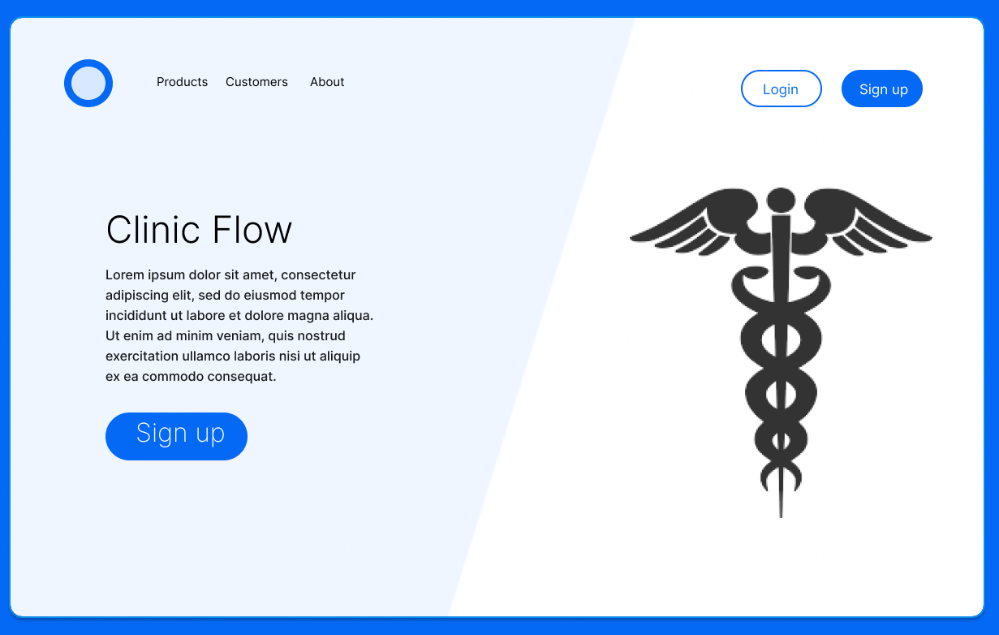

# Clinic Flow

## Description

    Clinic Flow is a clinic management application designed for healthcare workers to manage their patient's health information such as medical records, prescriptions, and doctor's appointments. I decided that I needed to build something useful with real-world application; something beyond the scope of what was taught to me in the classroom. 
    
    My mother, who works as an ER nurse, inspired me to create this application based in the medical field. I believe this app to showcase the culmination of all I have learned in my web dev journey and although it's something that hasn't already been done, it is my attempt at solving the problem of keeping one's medical records on paper. In this day and age, with everything being digitally uploaded, it is crucial to transfer files to a more permanent and safe location. Even more so, with digitized EHR, care providers are able to more easily transfer records between healthcare providers, should the circumstances arise. 

    In summation, this application would greatly benefit healthcare workers to have all the information they need at their fingertips and in one compartmentalized health portal. 

## Table of Contents
- [Clinic Flow](#clinic-flow)
  - [Description](#description)
  - [Table of Contents](#table-of-contents)
  - [Usage](#usage)
  - [License](#license)
  - [Badges](#badges)
  - [Features](#features)

## Usage 

    On the landing page, you will be prompted to first create an account. Afterwards, you will be able to use those credentials to log in when necessary to access the website in it's entirety. 
    
<p align="center">

</p>
  
    Upon login, you will be redirected to your dashboard. From here, you will have access to a variety of pages. Depending on the device you are accessing this website from, you will either use the burger menu to view these pages or they will be visible in the navigation bar located at the top of the viewport. 

  ```md
  
  ```

    Clicking on the Patient's tab will redirect you to a page where new patient information can be entered. Generic information about the patient can be entered into a form here. 
    
```md

  ```

    Clicking on the Prescriptions tab will allow you to access all patient's prescriptions and medications records. 

```md

```

    Clicking on the Appointments tab will bring you to a calendar that displays which days your patient(s) have their appointments on. From here, you can either edit their appointment details and/or cancel their appointments. 

```md

```

## License

[](https://opensource.org/licenses/MIT)

    MIT License 

    Copyright (c) 2024 Antonio Leonedes Robledo-Ysasaga

    Permission is hereby granted, free of charge, to any person obtaining a copy
    of this software and associated documentation files (the "Software"), to deal
    in the Software without restriction, including without limitation the rights
    to use, copy, modify, merge, publish, distribute, sublicense, and/or sell
    copies of the Software, and to permit persons to whom the Software is
    furnished to do so, subject to the following conditions:

    The above copyright notice and this permission notice shall be included in all
    copies or substantial portions of the Software.

    THE SOFTWARE IS PROVIDED "AS IS", WITHOUT WARRANTY OF ANY KIND, EXPRESS OR
    IMPLIED, INCLUDING BUT NOT LIMITED TO THE WARRANTIES OF MERCHANTABILITY,
    FITNESS FOR A PARTICULAR PURPOSE AND NONINFRINGEMENT. IN NO EVENT SHALL THE
    AUTHORS OR COPYRIGHT HOLDERS BE LIABLE FOR ANY CLAIM, DAMAGES OR OTHER
    LIABILITY, WHETHER IN AN ACTION OF CONTRACT, TORT OR OTHERWISE, ARISING FROM,
    OUT OF OR IN CONNECTION WITH THE SOFTWARE OR THE USE OR OTHER DEALINGS IN THE
    SOFTWARE.

## Badges


## Features 

    Fully-customizable profile 